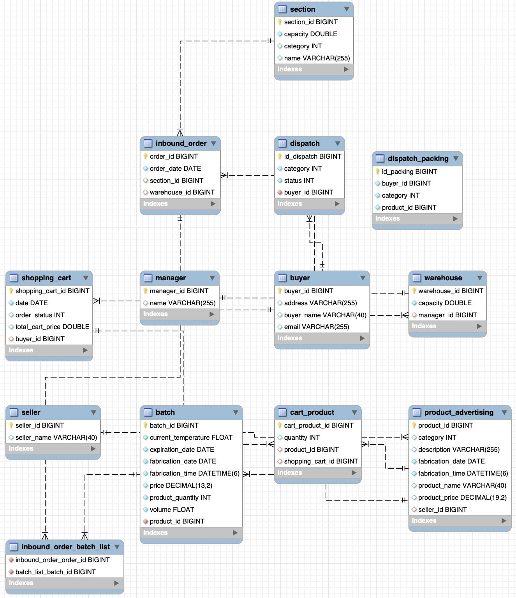

Embalagem e distribuição
--
O desenvolvimento contempla o processo de embalagem e distribuição dos produtos.
Na medida em que ocorrem as vendas no Marketplace de produtos que temos em
estoque no Fulfillment, as compras são filtrados por status **finalizado**. Essas compras finalizadas são
registradas em uma tabela para o processo de embalagem. Uma vez embalados os produtos, os pacotes são despachados com o transporte para
que sigam no trajeto de distribuição.

## Tecnologias
- O desafio foi realizado utilizando Java 11 com Spring Boot, suas anotações de validação somando as dependências:
    - Mesmas usadas nos requisitos de 1-5
    - JavaMail.
    - Swagger.
  
## O que foi desenvolvido
As rotas implementadas para contemplar o desenvolvimento:
- `/api/v1/ordersByDispach/packing`: Responsável por retornar os carrinhos de compra com status de finalizado - coleta.

- `/api/v1/ordersByDispach/save-finished-purchases`: Responsável por salvar os produtos com status de finalizados na tabela de montagem/embalagem/embalagens que precisam ser montados.

- `/api/v1/ordersByDispach/pack-products`: Responsável por empacotar na mesma embalagem os produtos com categoria e comprador iguais.

- `/api/v1/ordersByDispach/dispatched-packages`: Responsável por listar todos os pacotes dispachados.

- `/api/v1/ordersByDispach/dispatch/{id}`: Responsável por atualizar status da entrega para entregue e encaminhar um email avisando para o comprador que o produto foi entrgue.

- `/api/v1/ordersByDispach/dispatch-entreges/delete`: Responsável por deletar as entregas com status de entrgue.

## Testes
Os testes de unidades e de integração foram feitos utilizando o JUnit para as assertions e Mockito para fazer os Mocks.

As camadas foram testadas, com cobertura de miníma de 80% de métodos e linhas, verificando a consistência dos métodos utilizados para o desenvolvimento do projeto.

## Documentação da API
As ferramentas escolhidas para documentar a API foi o Postman, Swagger, Documentação em PDF e JavaDoc para o projeto.

⚠️ Acesse a documentação do Postman [aqui](https://documenter.getpostman.com/view/23722006/2s8YmUMfi8)

⚠️ Rode o projeto e acesse a documentação do Swagger pela [rota](http://localhost:8080/swagger-ui.html)

⚠️ Acesse a documentação em PDF [aqui](https://drive.google.com/drive/u/0/my-drive) 

## Diagrama de Entidade-Relacionamento (DER)

## Como acessar o projeto
:warning: Acessar o repositório do desafio [aqui](https://github.com/wave7-grupo3/desafio_integrador)

Abrir o terminal e digitar as informações na sequência:
- Realizar o clone do projeto:
    - SSH: `git clone git@github.com:wave7-grupo3/desafio_integrador.git`
    - HTTPS: `git clone https://github.com/wave7-grupo3/desafio_integrador.git`

- Ter o ambiente configurado para vizualização de projetos java.
- Gerar a documentação do JavaDocs:
    - Na barra superior da IDE IntelliJ, selecionar a aba `Tools`;
    - Em seguida, selecionar `generate JavaDoc`;

## Autora
- GitHub - [Ingrid Paulino](https://github.com/IngridPaulino)
